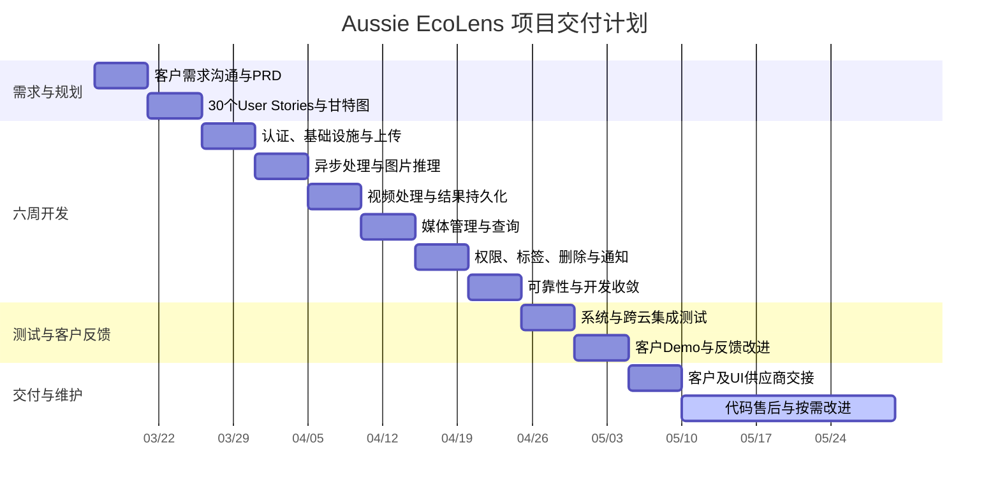

# 项目甘特图

> 时间轴用于展示项目阶段顺序。图中的起始日期用于表达阶段长度，并非已验证的实际会议日期；对外发布前应根据原会议邀请、PRD 版本记录和交接记录校准。

## 阶段门禁

| Gate | 进入条件 | 退出条件 |
| --- | --- | --- |
| G1 需求确认 | 客户目标和使用场景已沟通 | PRD 经内部可行性 Review |
| G2 进入开发 | 30 个 Stories、依赖和甘特图完成 | 当周 Stories 可测试、可分配 |
| G3 开发完成 | Must Stories 进入验收 | 核心链路通过内部 Demo |
| G4 客户验收 | 系统测试和 Demo 环境准备完成 | 客户反馈已记录并完成约定改进 |
| G5 正式交付 | 发布候选版本稳定 | 文档、接口和 UI 供应商交接完成 |
| G6 售后维护 | 交付完成 | 持续按问题单响应，无固定结束日期 |
